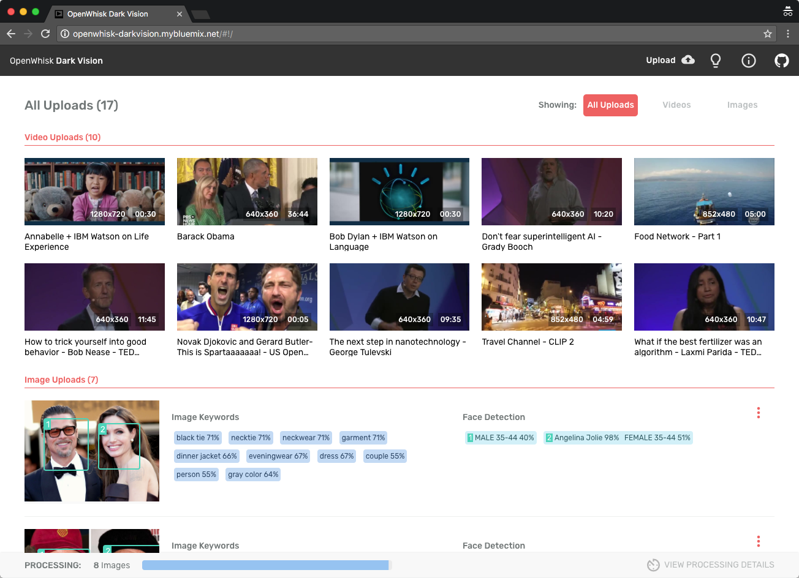
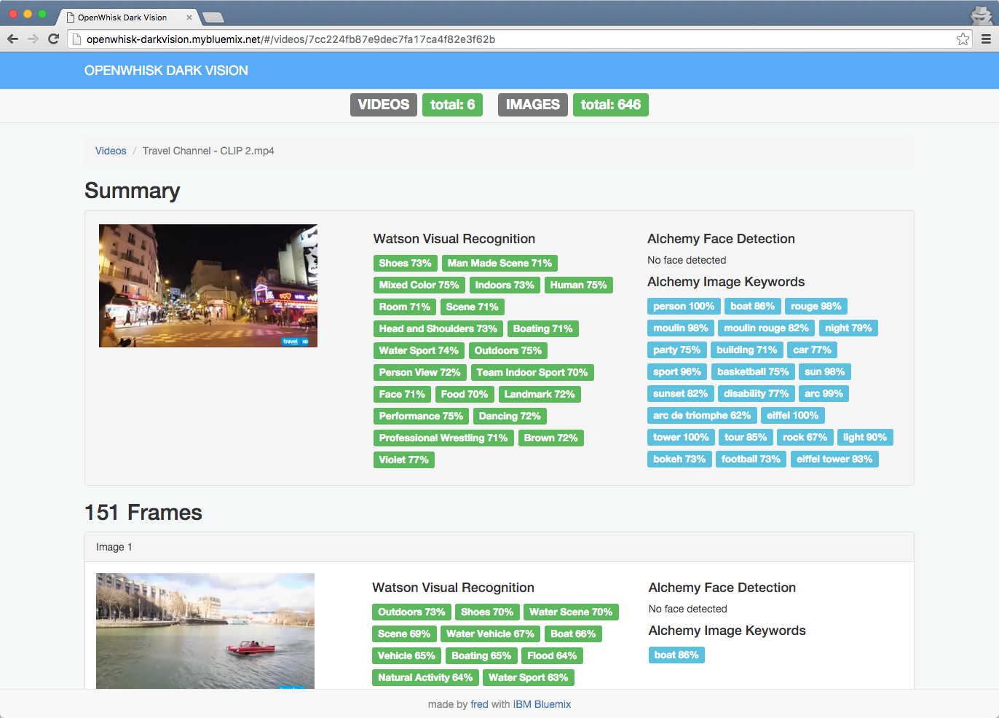
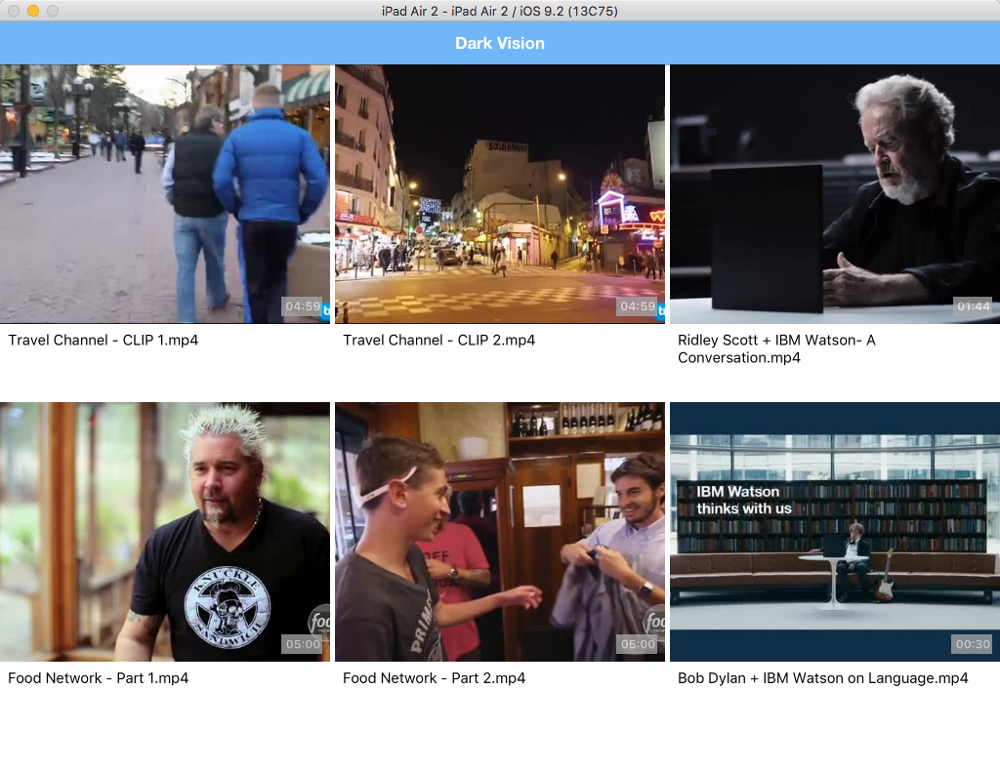
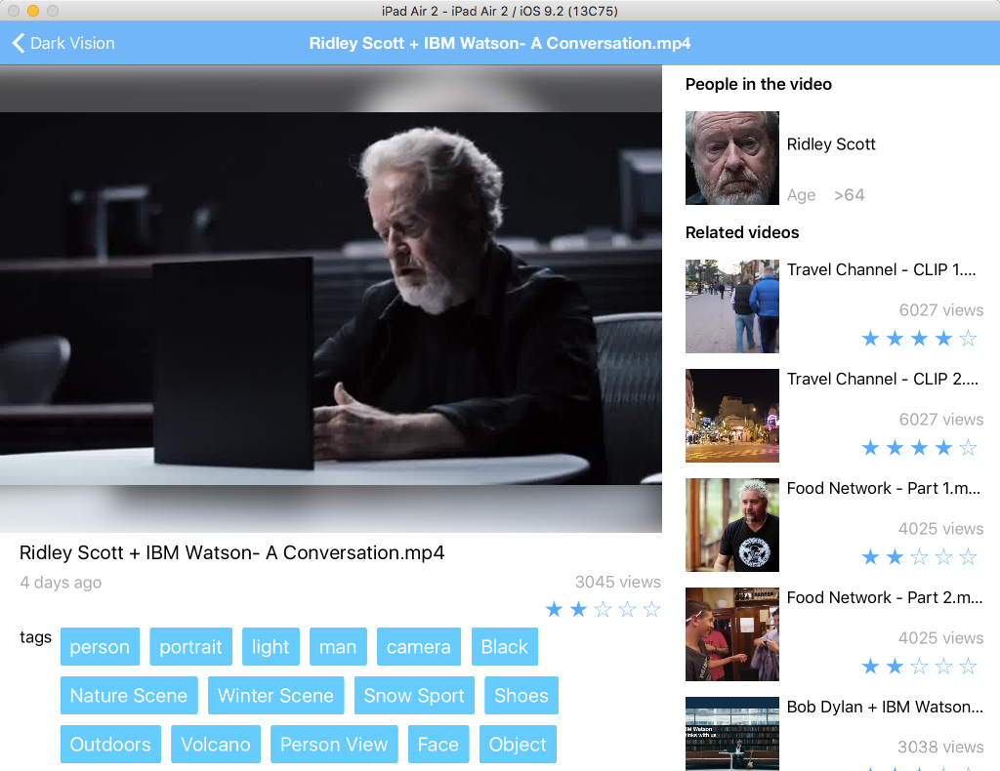
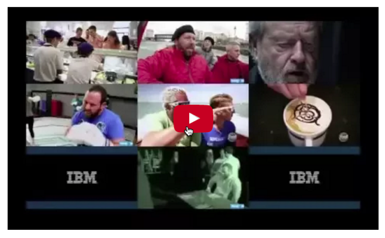
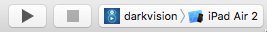
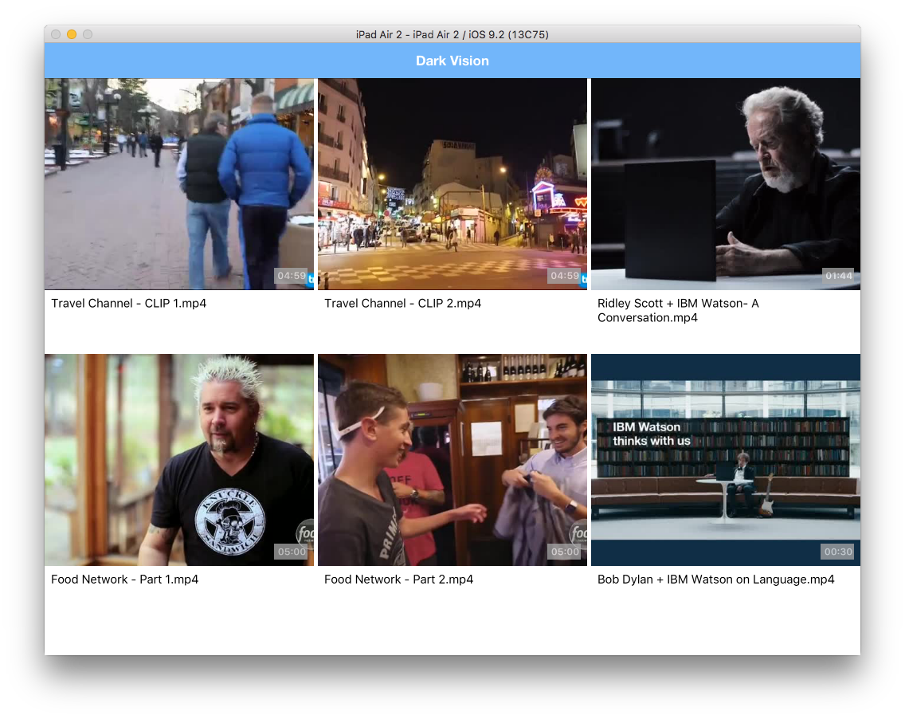

# Cloud Functions Dark Vision - Discover dark data in videos with IBM Watson and IBM Cloud Functions

[](https://travis-ci.org/IBM-Cloud/openwhisk-darkvisionapp)

> Dark Vision is a technology demonstration leveraging Cloud Functions and Watson services. If you are looking for an official and supported IBM offering head over to the [Watson Video Enrichment product](https://www.ibm.com/watson/media/). This product uses Watson APIs and additional technology to enrich video assets.

Think about all the videos individuals and companies (Media and Entertainment) accumulate every year. How can you keep track of what's inside of them so you can quickly search and find what you're looking for? *Show me all the videos that have Arc De Triomphe in it.* or *Show me the all the videos that talk about peaches*

What if we used artificial intelligence to process these videos to tell us which video has what we're looking for without us having to watch all of them.

Dark Vision is an application that processes videos to discover what's inside of them. By analyzing individual frames and audio from videos with IBM Watson Visual Recognition and Natural Language Understanding, Dark Vision builds a summary with a set of tags, famous people or landmarks detected in the video. Use this summary to enhance video search and categorization.

<p align="center">
  
  
  
  
</p>

### Watch this Youtube video to learn more about the app

[](https://www.youtube.com/watch?v=1teIMpkI_Sg&feature=youtu.be "Dark Vision")

## Overview and Architecture

 Built using IBM Cloud, the application uses:
  * [Visual Recognition](https://console.bluemix.net/catalog/services/watson_vision_combined)
  * [Speech to Text](https://console.bluemix.net/catalog/services/speech_to_text)
  * [Natural Language Understanding](https://console.bluemix.net/catalog/services/natural-language-understanding)
  * [Cloud Functions](console.bluemix.net/openwhisk/)
  * [Cloudant](https://console.bluemix.net/catalog/services/cloudantNoSQLDB)
  * [Object Storage](https://console.bluemix.net/catalog/services/Object-Storage) (optional component)

### Extracting frames and audio from a video

The user uploads a video or image using the Dark Vision web application, which stores it in a Cloudant Database (1). Once the video is uploaded, Cloud Functions detects the new video (2) by listening to Cloudant changes (trigger).
Cloud Functions then triggers the video and audio extractor action (3). During its execution, the extractor produces frames (images) (4), captures the audio track (5) and stores them in Cloudant (6, 7). The frames are then processed using Watson Visual Recognition, the audio with Watson Speech to Text and Natural Language Understanding. The results are stored in the same Cloudant DB. They can be viewed using Dark Vision web application or the iOS application.

Object Storage can complement Cloudant. When doing so, video and image medadata are stored in Cloudant and the media files are stored in Object Storage.


<details>
<summary></summary>
extract_video
  digraph G {
    node [fontname = "helvetica"]
    rankdir=LR
    /* stores a video */
    user -> storage [label="1"]
    /* cloudant change sent to openwhisk */
    storage -> openwhisk [label="2"]
    /* openwhisk triggers the extractor */
    openwhisk -> extractor [label="3"]
    /* extractor produces image frames and audio */
    extractor -> frames [label="4"]
    extractor -> audio [label="5"]
    /* frames and audio are stored */
    frames -> storage [label="6"]
    audio -> storage [label="7"]
    /* styling ****/
    frames [label="Image Frames"]
    audio [label="Audio Track"]
    storage [shape=circle style=filled color="%234E96DB" fontcolor=white label="Data Store"]
    openwhisk [shape=circle style=filled color="%2324B643" fontcolor=white label="Cloud Functions"]
  }
extract_video
)
</details>

### Processing frames and standalone images

Whenever a frame is created and uploaded (1), Cloudant emits a change event (2) and
Cloud Functions triggers the analysis (3). The analysis (4) is persisted with the image (5).


<details>
<summary></summary>
image_analysis
  digraph G {
    node [fontname = "helvetica"]
    /* stores a image */
    frame -> storage [label="1"]
    /* cloudant change sent to openwhisk */
    storage -> openwhisk [label="2"]
    /* openwhisk triggers the analysis */
    openwhisk -> analysis [label="3"]
    /* extractor produces image frames */
    {rank=same; frame -> storage -> openwhisk -> analysis -> watson [style=invis] }
    /* analysis calls Watson */
    analysis -> watson [label="4"]
    /* results are stored */
    analysis -> storage [label="5"]
    /* styling ****/
    frame [label="Image Frame"]
    analysis [label="analysis"]
    storage [shape=circle style=filled color="%234E96DB" fontcolor=white label="Data Store"]
    openwhisk [shape=circle style=filled color="%2324B643" fontcolor=white label="Cloud Functions"]
    watson [shape=circle style=filled color="%234E96DB" fontcolor=white label="Watson\nVisual\nRecognition"]
  }
image_analysis
)
</details>

### Processing audio

Whenever the audio track is extracted (1), Cloudant emits a change event (2) and
Cloud Functions triggers the audio analysis (3).

#### Extract the audio transcript

Extracting the transcript from an audio track using the Speech to Text service may take more than 5 minutes depending on the video. Because Cloud Functions actions have a 5 minutes limit, waiting in the action for the audio processing to complete is not possible for longer videos. Fortunately the Speech to Text service has a very nice [asynchronous API](https://www.ibm.com/watson/developercloud/speech-to-text/api/v1/?curl#async_methods). Instead of waiting for Speech to Text to process the audio, Dark Vision sends the audio file to Speech to Text (4) and Speech to Text will notify Dark Vision with the transcript when it is done processing the audio (5). The result is attached to the audio document (6).


<details>
<summary></summary>
extract_audio
  digraph G {
    node [fontname = "helvetica"]
    audio -> storage [label="1"]
    storage -> openwhisk [label="2"]
    openwhisk -> speechtotext [label="3"]
    speechtotext -> watson [label="4 - Start Recognition"]
    watson -> speechtotext [label="5 - Receive transcript"]
    speechtotext -> storage [label="6 - Store transcript"]
    audio [label="Audio Track"]
    {rank=same; audio -> storage -> openwhisk -> speechtotext -> watson [style=invis] }
    storage [shape=circle style=filled color="%234E96DB" fontcolor=white label="Data Store"]
    openwhisk [shape=circle style=filled color="%2324B643" fontcolor=white label="Cloud Functions"]
    speechtotext [label="speechtotext"]
    watson [shape=circle style=filled color="%234E96DB" fontcolor=white label="Watson\nSpeech to Text"]
  }
extract_audio
)
</details>

#### Analyze the transcript

Once the transcript is stored (1), the text analysis (3) is triggered (2) to detect concepts, entities and emotion (4). The result is attached to the audio (5).


<details>
<summary></summary>
audio_analysis
  digraph G {
    node [fontname = "helvetica"]
    transcript -> storage [label="1"]
    storage -> openwhisk [label="2"]
    openwhisk -> textanalysis [label="3"]
    textanalysis -> nlu [label="4"]
    textanalysis -> storage [label="5"]
    /* extractor produces image frames */
    {rank=same; transcript -> storage -> openwhisk -> textanalysis -> nlu [style=invis] }
    /* styling ****/
    transcript [label="Transcript"]
    textanalysis [label="textanalysis"]
    storage [shape=circle style=filled color="%234E96DB" fontcolor=white label="Data Store"]
    openwhisk [shape=circle style=filled color="%2324B643" fontcolor=white label="Cloud Functions"]
    nlu [shape=circle style=filled color="%234E96DB" fontcolor=white label="Natural\nLanguage\nUnderstanding"]
  }
)
audio_analysis
</details>

## Prerequisites

* IBM Cloud account. [Sign up][bluemix_signup_url] for Bluemix, or use an existing account.
* Docker Hub account. [Sign up](https://hub.docker.com/) for Docker Hub, or use an existing account.
* Node.js >= 6.9.1
* XCode 8.0, iOS 10, Swift 3 (For iOS application)

## Deploying Dark Vision automatically in IBM Cloud

Dark Vision comes with a default toolchain you can use to deploy the solution with few clicks. If you want to deploy it manually, you can skip this section.

1. **Ensure your organization has enough quota for one web application using 256MB of memory and 4 services.**

1. Click ***Deploy to IBM Cloud*** to start the IBM Cloud DevOps wizard:

  [](https://console.bluemix.net/devops/setup/deploy/?repository=https%3A%2F%2Fgithub.com/IBM-Cloud/openwhisk-darkvisionapp)

  > :warning: Dark Vision can currently only be deployed in the US South region.

1. Select the **GitHub** box.

1. Decide whether you want to fork/clone the Dark Vision repository.

1. If you decide to Clone, set a name for your GitHub repository.

1. Select the **Delivery Pipeline** box.

1. Select the region, organization and space where you want to deploy the web application.

  > :warning: Make sure the organization and the space have no *space* in their names. There is [an open issue around this](https://github.com/IBM-Cloud/openwhisk-darkvisionapp/issues/54).

1. Set the name of the Dark Vision web application. Pick a unique name to avoid conflicts.

1. Optionally set the admin username and password for the application. When set, the application will prompt for this username and password when uploading videos/images, when resetting a video or an image. If the username and password are not defined, any visitor can upload videos/images for processing.

1. If you already have a Watson Visual Recognition service instance you want to reuse, retrieve its API key from the credentials and set the value in the form. If you leave the field empty, the pipeline will create a new service instance automatically.

1. Click **Create**.

1. Select the Delivery Pipeline named **darkvision**.

1. Wait for the Deploy job to complete.

1. Access the Dark Vision app when it's ready and start uploading videos and images!

## Deploying Dark Vision manually in IBM Cloud

The automatic approach should be the best option for most users as it does everything for you automatically. But if you want to go through all the steps manually or if you want to run the web application locally we've got your covered. Follow [these instructions](./DEPLOY_MANUALLY.md).

## iOS application to view the results (Optional)

The iOS application is a client to the API exposed by the web application
to view the results of the analysis of videos. It is an optional piece.

To configure the iOS application, you need the URL of the web application deployed above.
The web app exposes an API to list all videos and retrieve the results.

1. Open **ios/darkvision.xcworkspace** with XCode

1. Open the file **darkvision/darkvision/model/API.swift**

1. Set the value of the constant **apiUrl** to the application host previously deployed.

1. Save the file

### Running the iOS application in the simulator

1. Start the application from XCode with *iPad Air 2* as the target

  

1. Browse uploaded videos

  

1. Select a video

  

  Results are made of the faces detected in the picture
  and of tags returned by Watson.
  The tags with the highest confidence score are shown.
  Tap a tag or a face to change the main image to the
  frame where this tag or face was detected.

## Code Structure

### Cloud Functions - Deployment script

| File | Description |
| ---- | ----------- |
|[**deploy.js**](deploy.js)|Helper script to install, uninstall, update the Cloud Functions trigger, actions, rules used by Dark Vision.|

### Cloud Functions - Change listener

| File | Description |
| ---- | ----------- |
|[**changelistener.js**](processing/changelistener/changelistener.js)|Processes Cloudant change events and calls the right actions. It controls the processing flow for videos and frames.|

### Cloud Functions - Frame extraction

The **frame extractor** runs as a Docker action created with the [Cloud Functions Docker SDK](https://console.bluemix.net/docs/openwhisk/openwhisk_reference.html#openwhisk_ref_docker):
  * It uses *ffmpeg* to extract frames and audio from the video.
  * It is written as a nodejs app to benefit from several nodejs helper packages (Cloudant, ffmpeg, imagemagick)

| File | Description |
| ---- | ----------- |
|[**Dockerfile**](processing/extractor/Dockerfile)|Docker file to build the extractor image. It pulls ffmpeg into the image together with node. It also runs npm install for both the server and client.|
|[**extract.js**](processing/extractor/client/extract.js)|The core of the frame extractor. It downloads the video stored in Cloudant, uses ffmpeg to extract frames and video metadata, produces a thumbnail for the video. By default it produces around 15 images for a video. This can be changed by modifying the implementation of **getFps**. First 15 min of audio is also exported.|
|[**app.js**](processing/extractor/server/app.js)|Adapted from the Cloud Functions Docker SDK to call the extract.js node script.|

### Cloud Functions - Frame analysis

[**analysis.js**](processing/analysis/analysis.js) holds the JavaScript code to perform the image analysis:

1. It retrieves the image data from the Cloudant document.
The data has been attached by the *frame extractor* as an attachment named "image.jpg".
1. It saves the image file locally.
1. If needed, it resizes the image so that it matches the requirements of the Watson service
1. It calls Watson
1. It attachs the results of the analysis to the image and persist it.

The action runs asynchronously.

The code is very similar to the one used in the [Vision app](https://github.com/IBM-Cloud/openwhisk-visionapp).

### Cloud Functions - Audio analysis

| File | Description |
| ---- | ----------- |
|[**speechtotext.js**](processing/speechtotext/speechtotext.js)|Uses Speech to Text to transcript the audio. It acts as the callback server for the [asynchronous API](https://www.ibm.com/watson/developercloud/speech-to-text/api/v1/?curl#async_methods) of Speech to Text service. The speechtotext action is exposed as a public HTTP endpoint by the [**deploy.js**](deploy.js) script.|
|[**textanalysis.js**](processing/textanalysis/textanalysis.js)|Calls Natural Language Understanding on the transcript.|

### Web app

The web application allows to upload videos (and images).
It shows the video and image catalog and for each video the extracted frames.

| File | Description |
| ---- | ----------- |
|[**app.js**](web/app.js)|The web app backend handles the upload of videos/images, and exposes an API to retrieve all videos, their frames, to compute the summary|
|[**Services**](web/public/js)|Services used by controllers|
|[**Home page**](web/public/routes/home)|Controller and view for the home page|
|[**Video page**](web/public/routes/video)|Controller and view for the video detail page|

### Shared code between Cloud Functions actions and web app

These files are used by the web application and the Cloud Functions actions. They are automatically injected in the Cloud Functions actions by the [**deploy.js**](deploy.js) script and during the [**build**](processing/extractor/buildAndPush.sh) of the Docker image. These scripts have dependencies on *Cloudant, async, pkgcloud* which are provided by default in Cloud Functions Node.js actions.

| File | Description |
| ---- | ----------- |
|[**cloudantstorage.js**](web/lib/cloudantstorage.js)|Implements API on top of Cloudant to create/read/update/delete video/image metadata and to upload files|
|[**cloudobjectstorage.js**](web/lib/cloudobjectstorage.js)|Implements the file upload operations on top of Cloud Object Storage. Used by [**cloudantstorage.js**](web/lib/cloudantstorage.js) when Cloud Object Storage is configured.|
|[**cloudant-designs.json**](web/lib/cloudant-designs.json)|Design documents used by the API to expose videos and images. They are automatically loaded into the database when the web app starts for the first time.|

### iOS

The iOS app is an optional part of the Dark Vision sample app.
It uses the API exposed by the web application to display
the videos in the catalog and their associated tags.

| File | Description |
| ---- | ----------- |
|[**API.swift**](ios/darkvision/model/API.swift)|Calls the web app API. Update the constant **apiUrl** to map to the location of your web app.|

## Contribute

Please create a pull request with your desired changes.

## Troubleshooting

### Dark Vision correctly processes video frames but does not process the audio track

This has been reported several times when using the toolchain.
It is tracked as [issue 51](https://github.com/IBM-Cloud/openwhisk-darkvisionapp/issues/51). Make sure to look at the toolchain DEPLOY log to confirm the problem. Locate the line *Registering Speech to Text callback...* to identify the error.

### Cloud Functions

Polling activations is good start to debug the Cloud Functions action execution. Run
```
wsk activation poll
```
and upload a video for analysis.

### Web application

Use
```
cf logs <appname>
```
to look at the live logs for the web application

[bluemix_signup_url]: https://console.bluemix.net/?cm_mmc=GitHubReadMe

## License

See [License.txt](License.txt) for license information.
